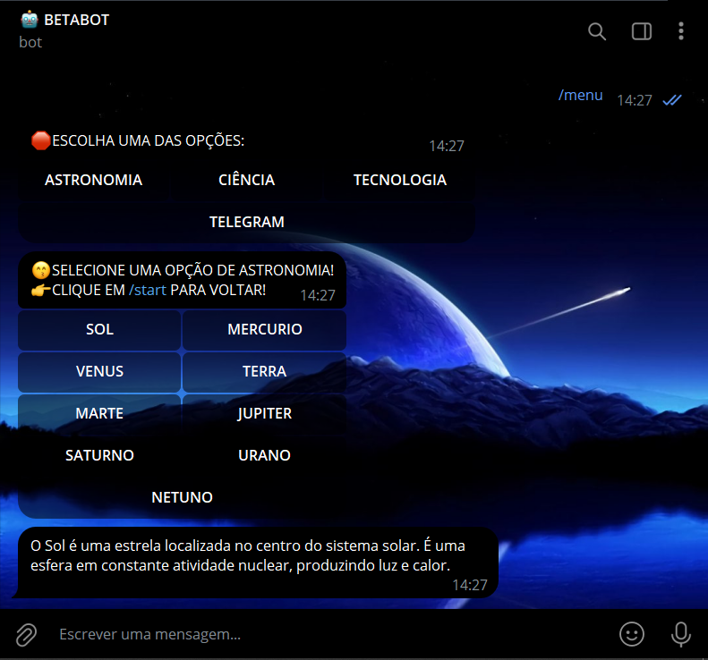

# COMANDOS DE BOTOES INLINES
🤤ESSE É UM BOT DO TELEGRAM QUE USA BOTÕES INLINES PARA MENU E SUB-MENUS!

 <br>

## DESCRIÇÃO:
Esse é um bot do Telegram que oferece opções de menu sobre diferentes tópicos (Astronomia, Ciência, Tecnologia e Telegram) e fornece informações sobre esses tópicos quando o usuário seleciona uma opção.

1. **Criação de botões inline**: Cada arquivo possui funções para criar botões inline, que são botões interativos que aparecem nas mensagens e permitem que os usuários interajam com o bot de maneira mais dinâmica.

2. **Callbacks para botões**: O bot têm handlers de callback para processar as seleções dos usuários quando eles interagem com os botões inline. Esses callbacks são acionados quando um usuário clica em um botão e executam ações com base na seleção feita.

3. **Organização em submenus**: Cada arquivo organiza suas funcionalidades em submenus, com botões que representam diferentes categorias ou opções de interação. Isso ajuda a manter o código organizado e facilita a navegação para os usuários.

4. **Respostas às seleções dos usuários**: Cada código tem funções para responder às seleções dos usuários com mensagens relevantes ou ações apropriadas, com base nos botões que foram pressionados.

## COMO USAR?
### BAIXANDO O PROJETO:
**Passo 1:** Clone o repositório para o seu sistema local.

```bash
git clone https://github.com/VILHALVA/COMANDOS-DE-BOTOES-INLINES.git
```

**Passo 2:** Navegue até o diretório do projeto.

```bash
cd COMANDOS-DE-BOTOES-INLINES
```

**Passo 3:** Descompacte o arquivo ZIP (se você baixou manualmente):

```bash
unzip COMANDOS-DE-BOTOES-INLINES
```

### EXECUTANDO O PROJETO:
1. **Coloque o Token:**
   - Antes de executar o programa, é necessário substituir o token do seu bot, o qual pode ser obtido por meio do [@BotFather](https://t.me/BotFather). Certifique-se também de que todas as dependências estejam instaladas em sua máquina. Se você não estiver familiarizado com esses passos, confira nosso [curso completo sobre a criação de bots no Telegram](https://github.com/VILHALVA/CURSO-DE-TELEGRAM-BOT) para obter orientações detalhadas.

2. **Inicie o Bot:**
   - Execute o bot do Telegram em Python iniciando-o com o seguinte comando:
```bash
   python MAIN.py
```
   - Inicie o bot enviando o comando `/start`. Receba uma mensagem de boas-vindas e clique nos botões.

## CREDITOS:
- [PROJETO CRIADO PELO VILHALVA](https://github.com/VILHALVA)


